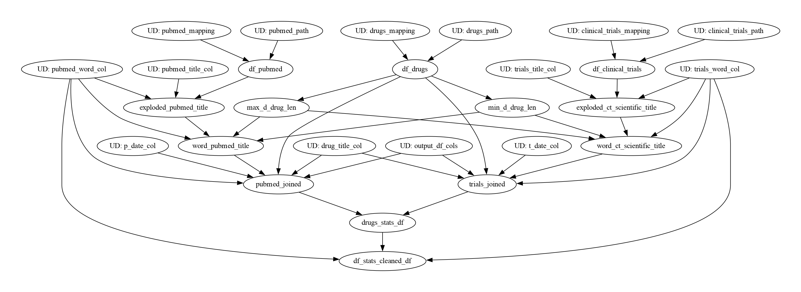

### Description

The goal of this project is to find drug mentions according to rules:
- drug is considered as mentioned in PubMed article or in clinical test if it's mentioned in publication title.
- drug is considered as mentioned in a journal if it is mentioned in publication issued by this journal.

input files are located in ```data``` folder.
They are: 
 - clinical_trials.csv
 - drugs.csv
 - pubmed.csv

### Repository folder structure

    .
    ├── data                   # contains local data
    ├── jobs                   # contains job modules
    ├── output                 # output folder
    ├── test                   # Automated tests (alternatively `spec` or `tests`)
    ├── utils                  # utility functions used in modules
    ├── main.py
    └── README.md

#### Running

Setup entry point is main function in main.py
```bash
$ python -s data/clinical_trials.csv data/drugs.csv data/pubmed.csv -o output/
```

### Framework
Hamilton is general purpose micro-framework for creating dataflows from python functions!
Hamilton project consists of 2 main components: Hamilton functions which define how
the DataFrame/Series are going to be processed and the driver code that runs the function modules.
To work with Hamilton you need to:
- Define your dataflow (a.k.a. pipeline), as a set of transforms using Hamilton's paradigm for writing python functions. 
- Specify the parameter values your dataflow requires
- Specify which outputs you want to compute from your dataflow


Hamilton provides a DAG for the dataflow.



### Tests
Hamilton pardigm makes testing much easier. We can also use Hamilton decorators to verify
data quality for each function in the module. Pandera (Fugue) can provide a more comprehensive 
platform for data/schema validation
#TODO
```unittest```

### Scaling Up
To be ready for billions of data points in production: 
- we have to optimize data loading. We can use the csv 
input files as Delta tables.
- we can experiment with executors and partitions to find the optimal number
- I used Pandas on Pyspark to be able to use Hamilton features to the fullest.
However, the API isn't mature and very optimized. That s why i had to resort to transforming
the DataFrames to Pyspark Dataframes. The way pandas and pyspark handle indexes is different 
so join operations aren't optimized in this situation. I enabled Apache Arrow to optimize the conversion between
pandas <-> pyspark.

